# YoloV3

YoloV3 Simplified for training on Colab with custom dataset. 

Full credit goes to [this](https://github.com/ultralytics/yolov3), and if you are looking for much more detailed explainiation and features, please refer to the original [source](https://github.com/ultralytics/yolov3).

## Results

After training for 300 Epochs on a dataset of just 100 images.

Output on small clip of video: [Link](https://youtu.be/R7b_hasDKlw)

Output on 16 test images:

| | | | |
:-------------------------:|:-------------------------:|:-------------------------:|:-------------------------:
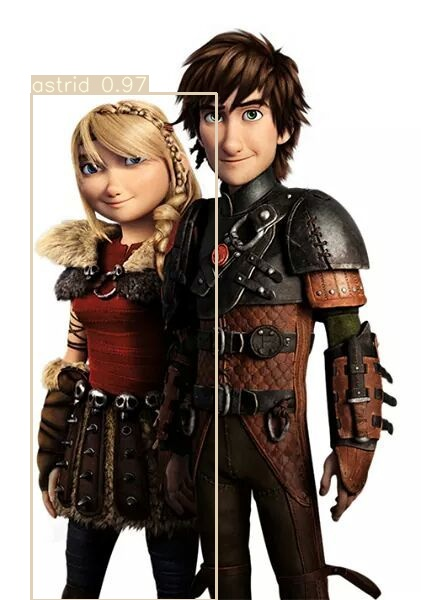  |  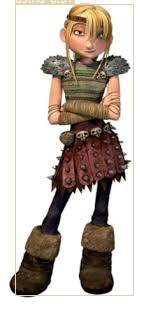 | 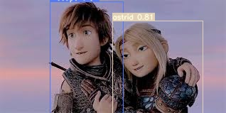  |  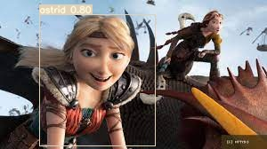
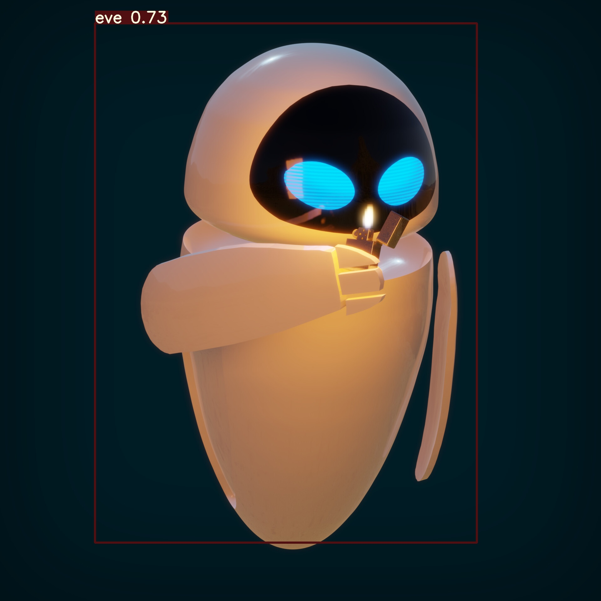  |   | 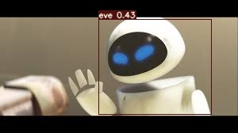  |  
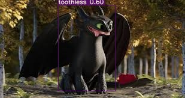  |  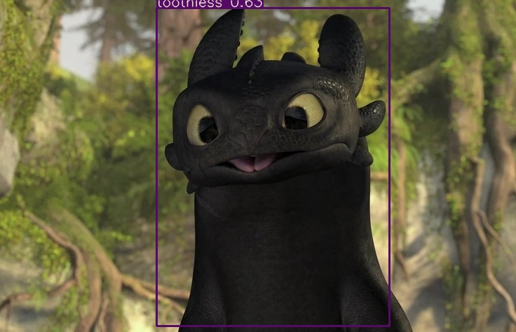 | 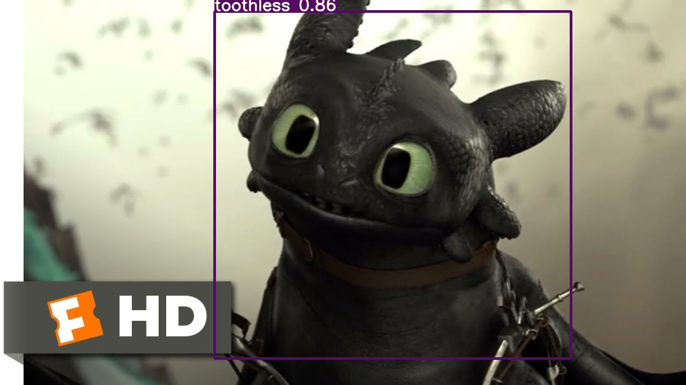  |  
  |  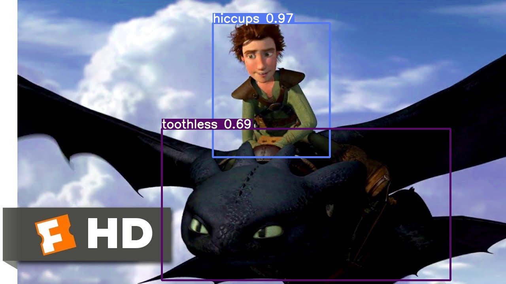 | 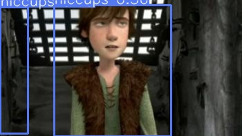  |  