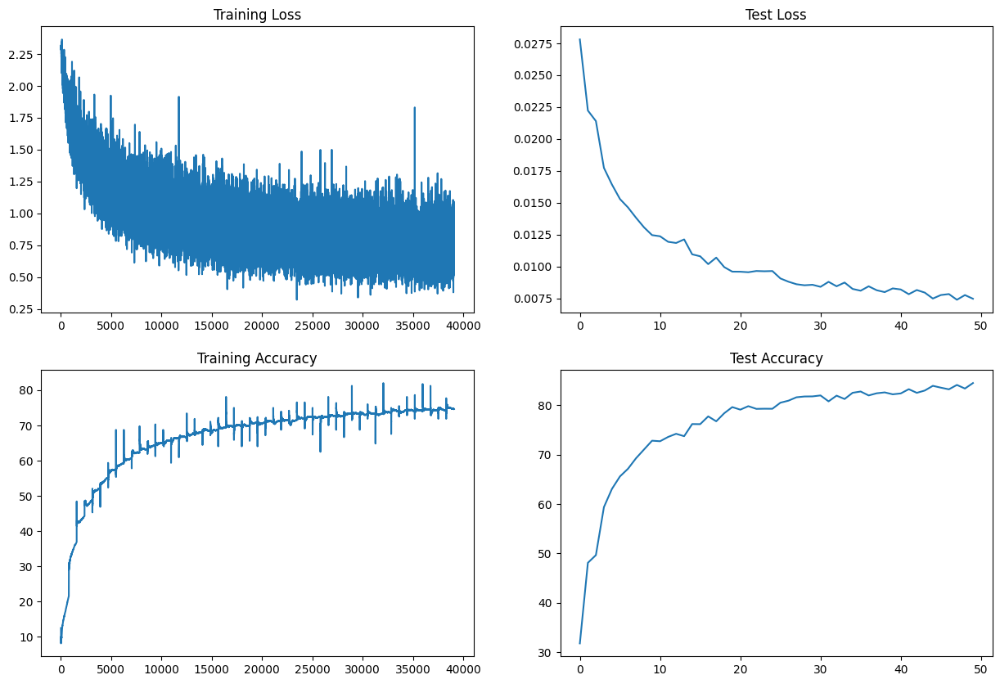

# Assignment 6

## Objective

- Obtain ~85% accuracy on CIFAR10
- No MaxPooling(Instead use strided or dilated Conv)
- RF must be greater than image size
- Use albumentations library

## Solution

### Network Architecture

[Image](architecture.png)

No. of Parameters - `148,302`

### Image Augmentations used

- `horizontal flip`
- `shiftScaleRotate`
- `coarseDropout (max_holes = 1, max_height=16px, max_width=1, min_holes = 1, min_height=16px, min_width=16px, fill_value=(mean of dataset), mask_fill_value = None)`

### Accuracy

- Training Accuracy - 74.64%
- Testing Accuracy - 84.52%

The augmentations we used works. It made the training dataset harder which helps prevent overfitting.

