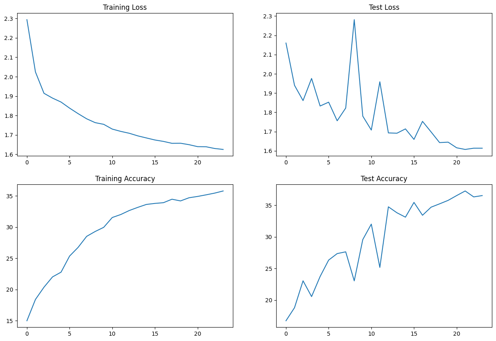

# Assignment 8

## Objective

- Define a basic Transformer architecture
- Train it on CIFAT10 dataset
- Use OneCyclePolicy
- Code should modular

## Solution

### Network Architecture

1. Add 3 Convolutions to arrive at AxAx48 dimensions (e.g. 32x32x3 | 3x3x3x16 >> 3x3x16x32 >> 3x3x32x48)
1. Apply GAP and get 1x1x48, call this X
1. Create a block called ULTIMUS that:

   - Creates 3 FC layers called K, Q and V such that:
     - X\*K = 48\*48x8 > 8
     - X\*Q = 48\*48x8 > 8
     - X\*V = 48\*48x8 > 8
   - then create AM = SoftMax(QTK)/(8^0.5) = 8\*8 = 8
   - then Z = V\*AM = 8\*8 > 8
   - then another FC layer called Out that:
     - Z\*Out = 8\*8x48 > 48

1. Repeat this Ultimus block 4 times
1. Then add final FC layer that converts 48 to 10 and sends it to the loss function.
1. Model would look like this C>C>C>U>U>U>U>FFC>Loss
1. Train the model for 24 epochs using the OCP

No. of Parameters - `56,496`

### Image Augmentations used

- `RandomCrop(32,32) after padding of 4`
- `horizontal flip`
- `coarseDropout (max_holes = 1, max_height=8px, max_width=8px, min_holes = 1, min_height=8px, min_width=8px, fill_value=(mean of dataset), mask_fill_value = None)`

### OneCyclePolicy Stats

- MaxLR = 0.001
- Epochs = 24
- pct_start = 0.15
- final_div_factor=1000

### Logs

